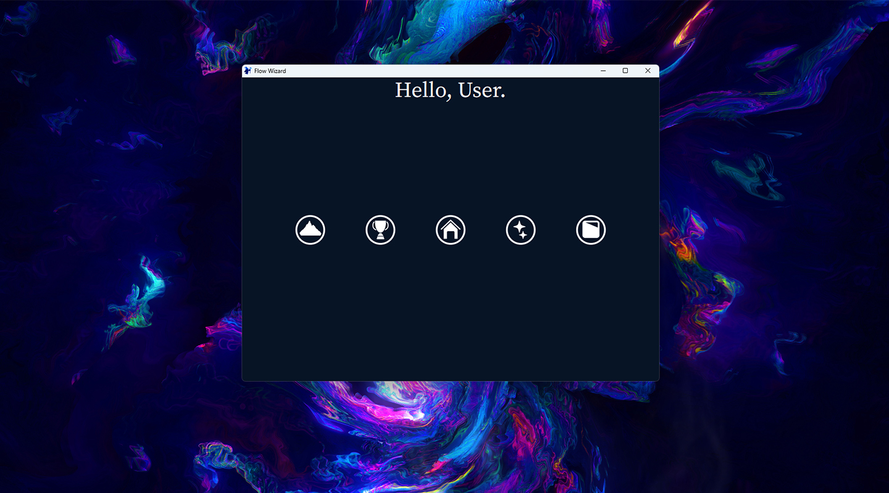
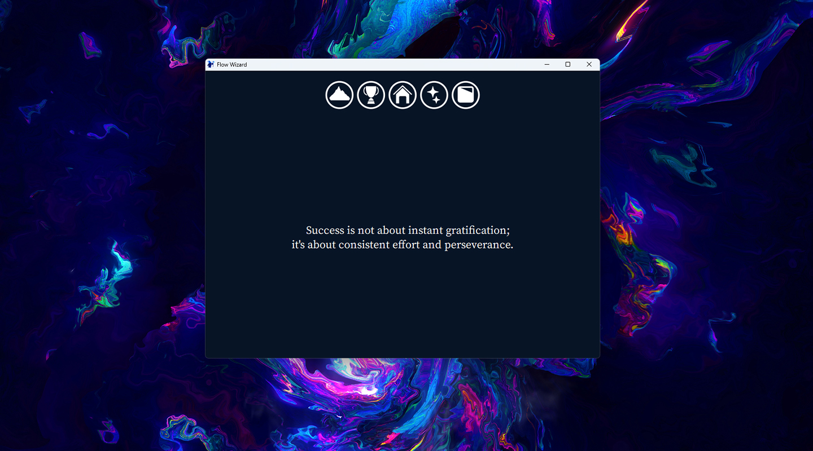
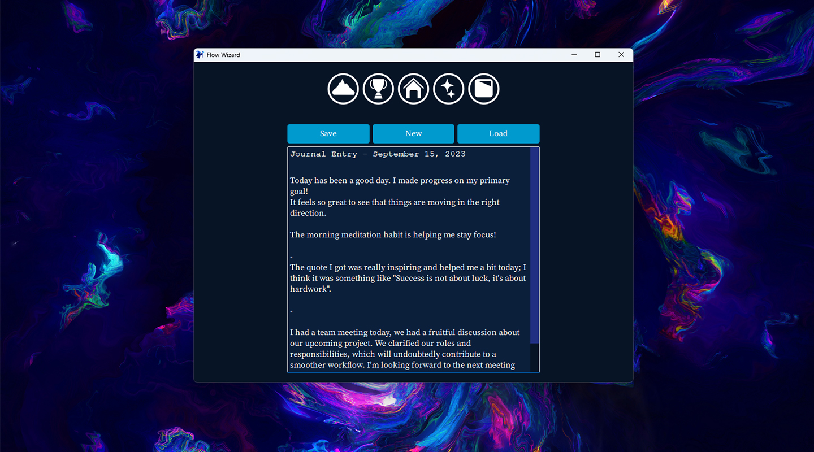
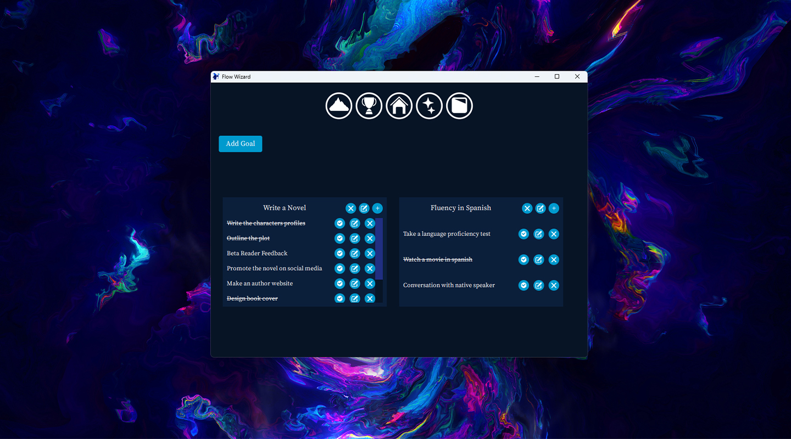
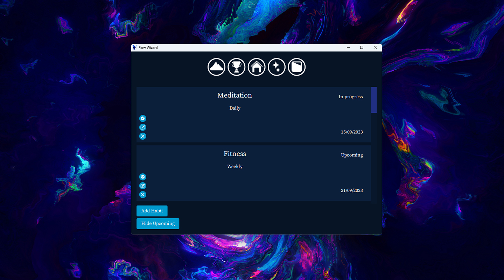

# Flow-Wizard

<div align="center">
  <a href="https://github.com/ahmedkerouat/Flow-Wizard">
    
  </a>
</div>

## Table of content

- [About the project](#aboutproject)
- [Features](#features)
- [Getting Started](#getstarted)
- [Example](#example)
- [Contributing](#contributing)
- [License](#license)

<a name="aboutproject"></a>

## About the project

Recently, I wanted to boost my productivity, striving to accomplish more and refine my organizational skills. This project is exactly what I had in mind (but it definitely took me more time than I thought): It's open source, available for everyone for free, and there's no need to worry about your privacy! 🚀

<a name="features"></a>

## Features

### Window Resizing

- Aspect Ratio Preservation: Adjust the window size without distortion.

### Motivation Button

- Instant Inspiration: Click the Motivation Button to receive a random motivational quote from a collection of 250 quotes.

### Notes Button

- Effortless Note-taking: Manage your notes seamlessly by clicking the Notes Button.
- Smart Note Management: Save and load your notes effortlessly. When you load a file, edit it, and save, it will overwrite the original file, preserving your changes. However, when you create a new note, edit it, and save, the app will prompt you to enter a name, ensuring you keep your notes organized.

### Goals Button

- Goal Management: Set up to 3 primary goals and an infinite number of subgoals with the Goals Button.
- Customize Goals: Modify goal names, edit subgoal details, mark tasks as done, or remove them as necessary.
- Automatic Progress Tracking: Every action is saved in a specific JSON file, ensuring your progress is always recorded and accessible. Furthermore, each time you open the app your goals data is automatically loaded.

### Habits Button

- Habit Creation: Use the Habits Button to add new habits with customizable titles and repetition frequencies (daily, weekly, monthly, yearly, or custom dates).
- Validation and Upcoming Habits: Habits due today appear as "In Progress" You can validate them, and they'll move to the next due date. Uncompleted habits with future due dates are categorized as "Upcoming"
- Upcoming Habits Management: Easily hide or reveal all upcoming habits with the "Hide Upcoming" button, which transforms into "Show Upcoming" when needed.
- Custom Habit Dates: Selecting "custom" for habit repetition opens a menu to choose specific due dates using multi-select combo box.
- Automatic Habit Saving: Every action performed in the Habits section is automatically saved in a JSON file.
- Automatic Habit Loading: When you open the app, your habit data is automatically loaded from the JSON file, ensuring that you can pick up right where you left off.

<a name="getstarted"></a>

## Getting Started

### Prerequisites

- git (https://git-scm.com/downloads)
- cmake (https://cmake.org/download)
- make (http://ftp.gnu.org/gnu/make)
- g++ (https://gcc.gnu.org)
- Qt (https://www.qt.io/download-open-source)

### Installation

```shell
> git clone https://github.com/ahmedkerouat/flow-wizard.git
> cd flow-wizard
> mkdir build
> cd build
> cmake ..
> make
> ./flow-wizard
```

<a name="example"></a>

## Example Usage

<div align="center">
    
    
    
    
    
</div>

<a name="contributing"></a>

## Contributing

Your contributions are greatly appreciated! If you have any suggestions to enhance the project, please feel free to create a pull request. Alternatively, you can open an issue to discuss your ideas. Don't forget to give a star ⭐️ – it's like a virtual high-five! Thank you for your valuable input!

<a name="license"></a>

## License

Project is licensed under the [MIT LICENSE](https://choosealicense.com/licenses/mit/)
